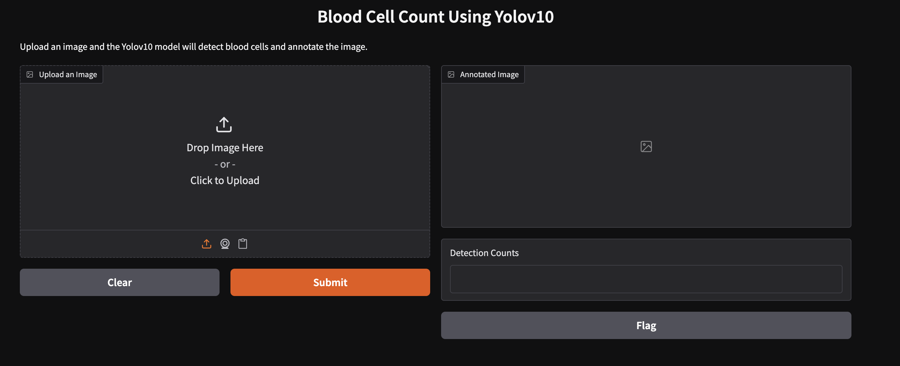
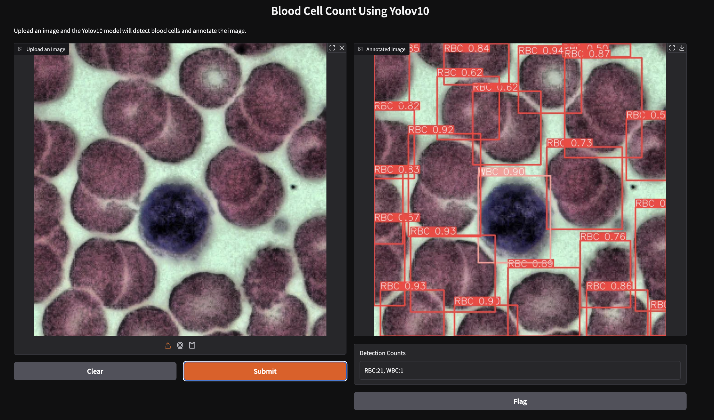

# Blood Cell Detection Using YOLOv10
This project uses the machine learning model, YOLOv10 to detect and classify blood cells from microscopic images.
The model was trained in Google Colab using a dataset from Roboflow.

## Features
- Object detection using YOLOv10n
- Detection of RBCs, WBCs, and platelets (or your dataset’s classes)
- Trained on a custom Roboflow dataset
- Google Colab training pipeline (GPU-accelerated)
- Automatic generation of training metrics (mAP, precision, recall)
- Supports inference on new images

## Screenshots

